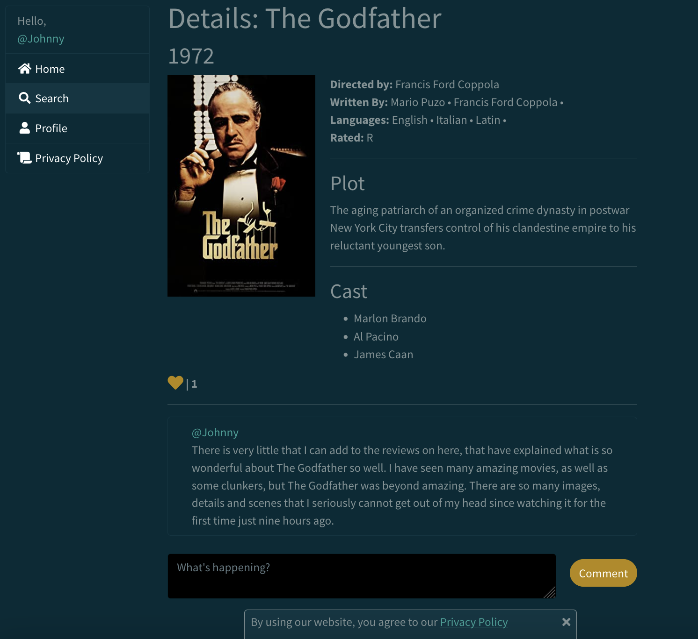
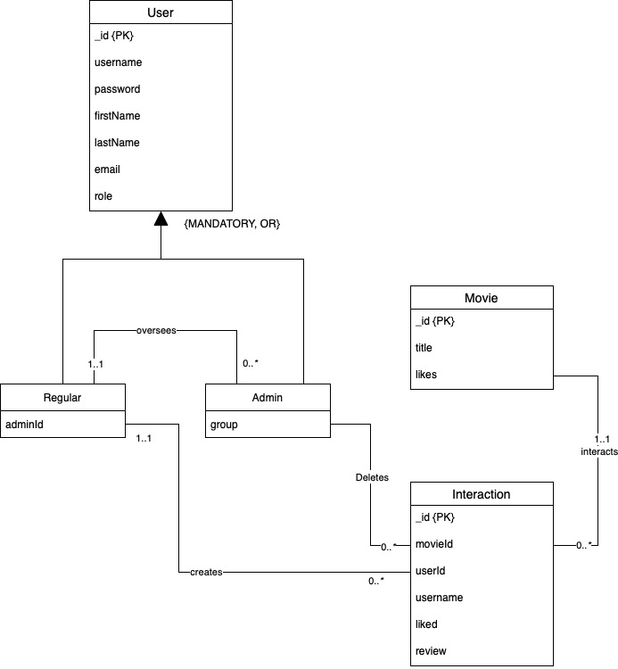

# IMDB Clone

This is a web development project using the IMDB API to create and store reviews in a personal MongoDB database. In this website, you can comment, like, and view information on movies in the IMDB database.

## Demo




## Run Locally

Clone the project

```bash
  git clone https://github.com/JCur24/IMDB-Clone.git
```

Navigate to the node, install dependencies, and run the backend server.

```bash
  cd node
  npm install
  node server.js
```

In a seperate terminal, navigate to the frontend directory. 
Finally, run the React app.

```bash
  cd frontend
  npm install
  npm start
```


## Database Schema



## Tech Stack

**Client:** React, Redux, CSS

**Server:** Node, Express

**Database:**  AWS MongoDB


